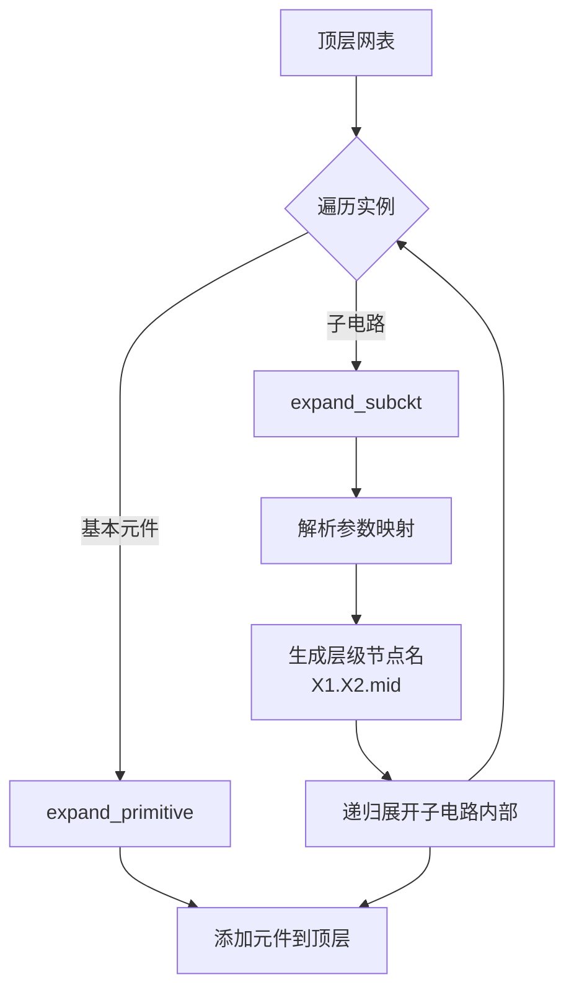

# 子电路展平

Tiny-SPICE 采用**一次性递归展平**策略处理 SPICE 的 `.subckt` / `.ends` 层次化网表。

## 展平过程



## 节点命名

子电路节点通过层级前缀避免冲突：

```
顶层:         n1, n2, gnd
实例 X1:      X1.n1, X1.n2, X1.gnd → gnd (别名)
实例 X1.X2:   X1.X2.n1, X1.X2.mid
```

所有节点最终通过 `NodeId`（整数）引用，地节点统一映射到索引 0。

## 参数传递

子电路实例的参数通过 `{expression}` 语法传递：

```spice
.subckt R_DIV n1 n2 n3 R1=1k R2=2k
R1 n1 n2 {R1}
R2 n2 n3 {R2}
.ends

X_DIV1 in mid out R_DIV R1=10k R2=20k
```

展平后 `{R1}` 被替换为 `10k`。

## 代码位置

展平逻辑位于 `src/expander.rs`，核心函数：

| 函数 | 职责 |
|------|------|
| `expand_instances()` | 遍历当前层级的所有实例 |
| `expand_primitive()` | 展开基本元件（R/C/D/V/I 等） |
| `expand_subckt()` | 递归展开子电路 |
| `expand_params()` | 解析和替换参数表达式 |

## 设计权衡

**优点**：
- 引擎面对扁平电路，寻址简单
- 不需要运行时层次遍历

**缺点**：
- 256 节点硬上限在大规模层次电路中容易触达
- 无法做层次化矩阵优化（商业 SPICE 的做法）

商业 SPICE（如 HSpice、Ngspice）使用层次化 MNA，在矩阵层面保留子电路边界，避免了节点数爆炸。
