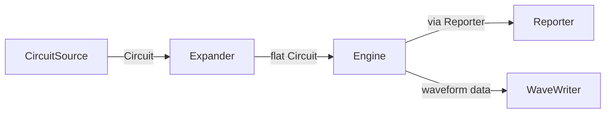
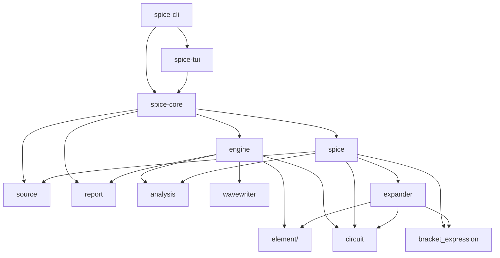

# 整体概览

Tiny-SPICE 采用**管道式架构 + trait 解耦**。数据从电路来源流入，经过解析、展开、仿真，最终输出波形。

## 数据流

## Crate 职责矩阵

| 层 | Crate | 外部依赖 | 核心 trait |
|---|---|---|---|
| 输入 | `spice-core::spice` | 无 | `CircuitSource` |
| 引擎 | `spice-core::engine` | 无 | 接收 `&Circuit` + `&Configuration` |
| 输出 | `spice-core::report` | 无 | `Reporter` |
| TUI | `spice-tui` | `indicatif` | 实现 `Reporter` |
| 组装 | `spice-cli` | `spice-core` + `spice-tui` | 选实现 + 注入 |

## 模块依赖（spice-core 内部）

## 关键设计决策

1. **零依赖核心** — `spice-core` 不依赖任何外部 crate，可直接嵌入其他项目
2. **Trait 解耦** — 输入（`CircuitSource`）和输出（`Reporter`）均通过 trait 抽象，可自由替换
3. **NodeId = usize** — 节点直接用整数索引，节点 0 硬编码为地，简化矩阵寻址
4. **统一 Stamp 接口** — 所有元件通过 `stamp_resistor`、`stamp_voltage_source`、`stamp_current_source` 贡献到 MNA
5. **伴随模型** — 非线性/储能元件通过 `linearize()` 输出 `(g_eq, i_eq)`，复用线性 Stamp
6. **一次性展平** — 子电路在解析阶段递归展平，引擎面对扁平电路
